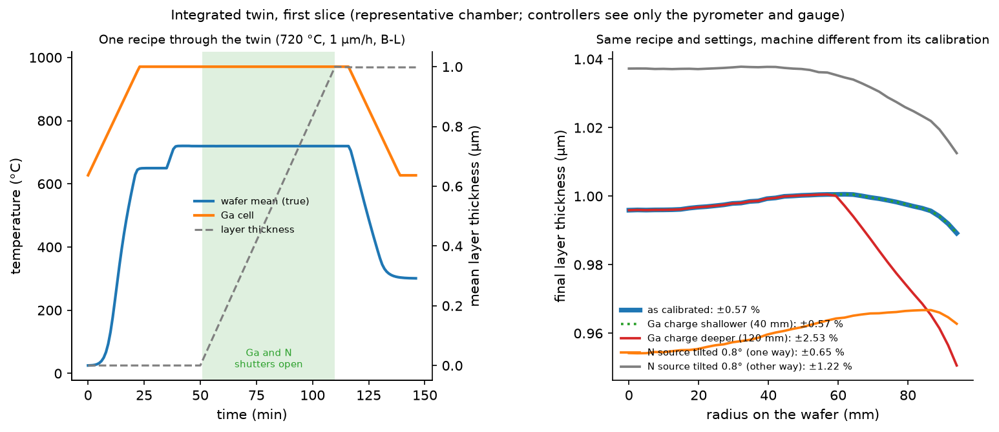
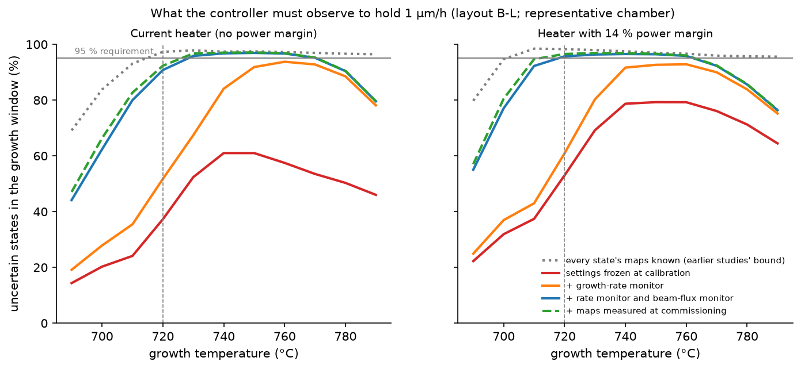

# GaN/AlN MBE digital twin

This project models a 200 mm molecular beam epitaxy (MBE) growth chamber to help design a machine that grows more uniform semiconductor layers. It studies how source positions, nitrogen supply, wafer heating and operating conditions affect the thickness of GaN grown on a silicon wafer.

The long-term scope includes GaN and AlN. The working growth model currently covers **GaN only**.

**Current state:** this is a research codebase with working physics models and design studies for a representative chamber. The proposed machine has not been built, and its drawings and measurements are not yet available. Several models have passed numerical checks, and the metal-source model has been compared with a published experiment. The nitrogen, heater and growth models still need experimental validation. A first integrated twin now runs complete growth recipes on the representative chamber; a twin calibrated to the proposed machine is not yet possible without its drawings and measurements.

This overview reflects the recorded studies through **6 October 2026**. The current provisional choices, the evidence for them and what would reopen them are in one place: the [decision record](docs/DECISION_RECORD.md). Detailed results and their reproduction commands are linked below.

## What the project is trying to achieve

MBE grows thin crystal layers by directing beams of material onto a heated wafer in a vacuum chamber. Heated cells supply gallium and aluminium; a plasma source supplies reactive nitrogen. The wafer rotates to spread the incoming material more evenly.

On a 200 mm wafer, source geometry and temperature differences can produce uneven growth. This project asks which changes would improve thickness uniformity while maintaining a useful growth rate and acceptable material quality. The model can compare design options before hardware is built, and later help interpret measurements from the machine.


*Representative geometry, not a drawing of the proposed machine. The baseline gallium source is 350 mm from the wafer centre, at 46° to the wafer axis.*

Success means a measured improvement on real wafers against an agreed baseline. A numerical uniformity target and minimum acceptable growth rate have not yet been agreed. Material quality will need its own measurements; the current model does not predict it.

## How the model works

The studies connect four main calculations:

1. **Material leaving the sources.** Calculate how the metal crucible and nitrogen outlet holes shape their beams.
2. **Material reaching the wafer.** Account for source position, wafer rotation, obstructions and scattering by gas in the chamber.
3. **Wafer temperature.** Calculate heat transfer between the heater, wafer and holder.
4. **GaN growth.** Combine the gallium supply, nitrogen supply and temperature at each point to estimate growth rate, thickness and whether gallium droplets form.

Layout studies combine these calculations with pumping capacity, heater limits and mechanical clearances. They also vary uncertain inputs to see whether a design still works when conditions differ from the nominal case.

The repository uses Python models, **SPARTA** for particle simulations with gas collisions, and **Elmer** for heat-transfer verification cases. The main heater design studies use a separate, simplified Python model. The workflow is intended to run on a laptop; larger particle simulations run in batches.

## What is implemented

| Area | Available now | Main limitation |
|---|---|---|
| Metal sources | Direct-beam transport, crucible emission, gas collisions, tilted liquid surfaces, fill-level changes and source-temperature adjustment | Gallium collision properties remain uncertain; experimental comparison uses a bismuth source |
| Nitrogen source | Outlet-plate geometry, beam maps, off-centre aiming, pointing errors and a particle simulation of flow through one hole | No measured active-nitrogen map; total reactive output is an uncertain input |
| Chamber gas | Pressure from nitrogen flow and effective pumping speed; direct-beam loss and scattered atoms returning to the wafer; gas plume near the nitrogen source | Simplified chamber and fixed gas fields; wall behaviour is uncertain |
| Heater and wafer | Radial radiation and conduction, heater zones, holder contact, power limits, temperature sensing and control studies | Simplified geometry; no measured heater validation |
| GaN growth | Steady-state growth rate, decomposition and gallium balance; nitrogen-limited growth and droplet onset | No transient growth, AlN chemistry, morphology or crystal-quality prediction |
| Layout comparison | Source and shutter clearances; coupled supply, pressure, temperature and thickness calculations across many operating cases | Assumed hardware dimensions and properties; no mechanical approval for the real machine |
| Integrated twin | A whole recipe (heat-up, plasma, shutters, growth, cool-down) run through the heater, sources, gas, growing surface and instruments together; controllers see only instrument readings | First version: radial, rotation-averaged maps; several hardware properties assumed; source and surface transients not yet included |
| Commissioning preparation | Measurement plan and rehearsals using synthetic data | No calibration or validation data from the proposed machine |

## What the studies have found

### Nitrogen and temperature determine thickness in gallium-rich growth

In the model's gallium-rich operating range, enough gallium is available everywhere and growth is mainly limited by reactive nitrogen. Thickness then follows the nitrogen map, with a temperature-dependent loss from GaN decomposition.

Gallium uniformity still matters: too little gallium leaves this operating range, while too much produces droplets. A flatter gallium beam alone therefore does not guarantee a flatter grown layer. The nitrogen, gallium and temperature maps have to be assessed together.

### The gallium beam changes as the crucible empties

The model follows evaporation from the liquid surface through the crucible and onto the rotating wafer. It includes the fact that liquid gallium stays level when its cell is tilted.

At the baseline 46° port angle, the predicted gallium supply variation grows from about **2% to 8–10% range/mean** as the liquid recedes from 40 mm to 120 mm below the crucible mouth. Steeper source angles can reduce this to roughly 1–2%, but the best angle changes with fill level. A fresh charge would spill at angles preferred by a nearly empty crucible, so one fixed angle cannot be optimal throughout a campaign.


The source must also run hotter as it empties to maintain the same gallium supply. The collision simulations require about a 12–13 °C increase across the studied fill range at 46°. These are gallium-arrival results; they do not directly predict layer thickness.

The source model has been compared with the published R07 bismuth experiment. It reproduces normalized deposition profiles to roughly 1–2%. Including paired bismuth atoms brings calculated absolute rates to approximately −6.5% to +5% of the measured rates. That supports the modelling method, but does not establish the collision properties of gallium.

### Nitrogen plate geometry and aim are major design choices

Long, narrow outlet holes produce a concentrated nitrogen beam. Aiming that beam at the wafer centre can give poor uniformity. Aiming near the wafer edge lets rotation distribute it more evenly, but makes alignment important. Shallow holes are generally less sensitive to pointing errors.


The plate must also pass enough gas. At high flow, collisions inside its holes can invalidate the simplest beam model. The repository includes a single-hole collision study, but it does not simulate the entire plasma source, reactive species or interactions between neighbouring holes.

The fraction of nitrogen feed that leaves the source in a reactive form is still unknown for the proposed hardware. Estimates from published growth rates depend on assumed geometry and are not supplier specifications.

### Heater design needs both an even temperature profile and enough power

The heater studies show that zone count alone is not enough. Radial power distribution, wafer contact with the holder and heat loss at the edge all matter. Measuring temperature at several radii helps control the profile; one centre reading mainly controls the overall temperature.

Heater limits also matter. A design that produces an even wafer in an unconstrained calculation may require an element temperature above its rating. The layout studies include that limit and variations in wafer heat emission and holder contact.

A cooler wafer reduces the thickness loss from decomposition, but narrows the allowable gallium supply range. The model therefore favours adjusting gallium supply using the wafer-temperature reading. The growth window must first be measured on the machine's own temperature scale.

### Scattered atoms cannot all be treated as lost

Gas in the chamber scatters atoms travelling toward the wafer. The latest studies follow those atoms after collisions, including through the denser gas near the nitrogen source. Many still reach the wafer, especially gallium atoms.

Including them changes the required nitrogen flow and the predicted thickness profile. It also makes the result depend on whether chamber walls absorb reactive nitrogen or return it to the gas. That behaviour needs measurement during commissioning.

### Running a whole recipe shows what fixed settings cannot absorb

The studies above look at one steady moment of growth. The integrated twin instead runs a complete recipe in time: the wafer heats up, the plasma ignites, the shutters open for an hour of growth and close again, and the wafer cools. The heater controller sees only what a pyrometer would read, and the gallium cell and nitrogen flow are set once, as a calibration on the machine would set them. Every gallium and nitrogen atom is accounted for through each shutter event, and a 2.4-hour recipe takes about 15 seconds on the laptop.



*Left: temperatures and layer thickness through the recipe. Right: the same recipe and settings when the real machine differs from the state it was calibrated in. Representative chamber, layout B-L, 720 °C, 1 µm/h.*

Run as calibrated, the twin reproduces the steady studies: 1 µm/h, about ±0.6 % thickness, the whole wafer inside the growth window. When the machine drifts from its calibration, three things show up:

- **The gallium charge matters most.** As the crucible empties to a deep fill, the same cell temperature delivers about 16 % less gallium; only 38 % of the wafer then stays in the growth window and the thickness spread rises to ±2.5 %. The 720 °C operating point needs the gallium flux to be measured as the charge is used. The earlier steady studies had quietly assumed that the controller knew this (pointed out by the 5 October audit). With a beam-flux measurement before growth and a growth-rate monitor, the twin's controllers bring the deep charge back to the calibrated result.
- **A small nitrogen pointing error shifts the growth rate** by about ±3.5 % at fixed nitrogen flow, so the rate has to be measured and the flow re-set, as commissioning would do.
- **The heater has no spare power at 720 °C.** Its zone settings were optimized right up to the element's temperature limit. If the wafer needs more heat (a temperature reading that is low, a change in wafer emission), the controller cannot supply it. The heater needs a power margin at the operating point.

The [integrated twin document](docs/INTEGRATED_TWIN.md) describes the model, its checks and what it does not yet include.

### What the controller has to measure

The earlier operating-point studies let the gallium controller know every uncertain detail of the machine. The study was rerun with controllers that use only a calibration fixed at commissioning and real instruments, then checked against every combination of pointing error, gallium fill, heater variation and growth law.



- With settings fixed at calibration, or with only a growth-rate monitor, no temperature keeps 95 % of the cases in the growth window.
- A **gallium beam-flux measurement** before growth is what makes the difference. Together with an in-situ growth-rate monitor it reaches 95 % at 730 °C with the current heater design.
- **Simpler configuration** (one centre pyrometer, no re-aim). A little spare heater power, with the zones laid out for an element about 13 K below its rating (about 4 % headroom), lets the standard-plate layout B-p run at 720 °C with a worst-case thickness spread of ±1.53 %. B-L needs 730 °C (±1.67 %). More spare power makes the controller more robust, but it widens the wafer's temperature range, which costs uniformity.
- **Most of the remaining worst case comes from two things:** the nitrogen source pointing slightly off, and wafer-to-wafer heating differences. Two changes address them:
  - re-aim the nitrogen source after commissioning, from a measured thickness map, to within about 0.2°;
  - read the wafer temperature at three radii and trim the heater zones in three groups.

  With both, the best model results at 1 µm/h are:
  - **B-L, aimed 5 mm further out (+95 mm): ±0.58 % at 720 °C**, with 99.99 % of the modelled cases inside the growth window and ±0.64 % over all of them. This is the recommended working point.
  - At 710 °C the cases that stay in the growth window reach ±0.53 %. But about 3 % of cases leave it, mostly with a nearly empty gallium charge, and their thickness spread reaches ±2.3 %. So 710 °C is slightly more even only for the cases that succeed. Both figures carry about ±0.04 point of Monte Carlo noise from the scattered-atom tables.
  - **B-p: ±0.57 % at 710 °C (±0.09 point from table noise), only if the gallium charge's fill level is tracked** and the calibrated beam shape for that fill is used. Without fill tracking, the share of modelled cases that pass at 710 °C sits right at the 95 % requirement (it passes in fewer than half of the noise resamples), and B-p's best point is ±0.62 % at 720 °C. B-p's figures also assume the nitrogen source converts all of its feed into active nitrogen, which no measured source does (see the design direction).
  - **The model cannot tell the two layouts apart on uniformity.** Earlier figures (B-p ±0.49 %, B-L ±0.65 %) used one random sample of the scattered-atom calculation each. That calculation is a Monte Carlo simulation, and one sample's statistical noise moves a worst case by about ±0.1 point for B-L and more for B-p. Averaging ten independent samples per layout removes most of it. To measure what remains, the samples were redrawn 40 times (a bootstrap) and each average rerun: the B-p − B-L difference is +0.04 ± 0.10 point, with B-L ahead in three of four redraws. That makes B-L likely no worse, but not demonstrably better.
  - **Re-aim checked:** a rehearsal of the commissioning re-aim on synthetic data shows the 0.2° correction is reachable if the source mount can be set and holds its setting to about 0.05° (0.3 mm at the flange), with three calibration wafers thickness-mapped to 0.1–0.3 %.
  - **B-L's nominal aim is +95 mm.** Rechecked with its own transport and pointing tables, the best aim lies between 95 and 97.5 mm; 2.5 mm off costs about 0.1 point. The scan reuses the 95 mm scattered-atom tables at the other aims, and the real aim is trimmed at commissioning.
  - **Caveats:** 710 °C uses the decomposition law 10 °C below the range it was fitted to (720–805 °C). The published data put decomposition near zero there, so this is a small effect on thickness. At 720 °C, inside that range, the values are ±0.62 % (B-p) and ±0.58 % (B-L).
- Measuring the beam maps at commissioning adds only 1–2 points on top of that. The rest of the gap is the instruments' accuracy and wafer-to-wafer heater variation. The beam-flux monitor's accuracy matters most for staying in the growth window.

## Current design direction

The provisional choice is **layout B-L** (changed from B-p on 2026-10-06). In both, the nitrogen source sits on the same port ring as the metal cells, with its beam aimed past the wafer centre. The two differ in the source's outlet plate, the disk of small holes the nitrogen leaves through:

- **B-L** uses a larger plate designed in this study (about 8000 holes of 0.5 mm), aimed 95 mm from the wafer centre. Its plate lets gas out easily, so the plasma bulb stays at low pressure even at high nitrogen flow. That is the condition under which a source converts a useful share of its nitrogen into the reactive atoms that grow GaN. B-L reaches 1 µm/h if about a quarter of the nitrogen is converted.
- **B-p** uses the published plate type (about 2000 holes of 0.34 mm), aimed 97.5 mm out. Its plate passes too little gas for 1 µm/h unless the source converts 80–90 % of its nitrogen. The one direct measurement of a source found at most 40 %, falling as bulb pressure rises ([research note](ref/notes/RESEARCH_GAP_SEARCH_2026-10-06.md)), and back-calculations from published growth rates give 6–57 %. B-p remains an alternative only if a supplier demonstrates much higher conversion.

The risk moves with the choice: B-L's plate is not a catalogue part, so the supplier must confirm that it can be made, fits the source and keeps the plasma lit.

The working rate is **1 µm/h**. The temperature is chosen for the best worst-case uniformity, which is the project's priority. Every option needs a gallium beam-flux monitor and an in-situ growth-rate monitor. Three configurations are on the table:

| Configuration | B-p (standard plate) | B-L (large plate) |
|---|---|---|
| One centre pyrometer, no re-aim | 720 °C, ±1.53 % (about 4 % heater headroom) | 730 °C, ±1.67 % |
| Re-aim to 0.2° + three-point heater control | 720 °C, ±0.62 % | 720 °C, ±0.58 % (aim +95 mm) |
| Same, at 710 °C (decomposition law extrapolated 10 °C) | ±0.57 % for the 95 % of cases that pass, **needs gallium fill tracking**; failing cases up to ±2.8 % | ±0.53 % for the 97 % that pass; failing cases up to ±2.3 % |

B-p's figures assume a source that converts all of its nitrogen feed into active nitrogen, with 2 m³/s of pumping. B-L's assume about 30 % conversion with 4 m³/s of pumping, inside the measured range. So the two columns are not equally achievable. With re-aim and three-point heater control the model cannot separate them on uniformity (the averaged-table figures carry about ±0.04 point for B-L and ±0.09 for B-p from Monte Carlo noise), so what decides between them is nitrogen output, pumping and whether B-L's larger plate can be built. The figures in the first row come from single Monte Carlo samples of the scattered-atom tables and are uncertain by about ±0.1 point.

All of these are modelling choices. They are conditional on nitrogen output, pumping, heater performance, the instruments' accuracy and acceptable crystal quality, which is not modelled and may set its own lower temperature limit. The temperatures are on the published growth laws' scales and must be calibrated on the real machine. The figures are worst cases over the grid conditions that stay in the growth window (at 720 °C almost all of them; at 710 °C see the table), not demonstrated wafer uniformity or a probability of production success. B-L's +95 mm aim is a nominal modelling choice, trimmed at commissioning.

The main decisions remain:

- **Nitrogen source and plate:** the larger B-L plate makes 1 µm/h achievable at more plausible reactive-nitrogen output, given strong pumping. Its manufacturability and stable plasma operating range need confirmation.
- **Pumping:** effective nitrogen pumping speed determines growth pressure. The present model does not establish whether weak pumping can support the intended rate.
- **What the chamber walls do to nitrogen atoms:** the model assumed each atom that hits a wall is lost. Published measurements suggest walls without plasma exposure return most atoms. If so, nitrogen arriving at the wafer roughly triples, so much less source output is needed (1 µm/h with B-L at 5–6 sccm instead of about 19). That could bring the standard-plate layout B-p back into range. In the one case tested (B-L, two Monte Carlo samples) uniformity was unchanged, because the returned atoms land almost evenly; this has not been checked for B-p or for how the returned share varies with source pointing. The commissioning nitrogen-limited thickness map and a pump-throttle test decide this.
- **Temperature measurement and gallium calibration:** the studies indicate a shared error allowance equivalent to roughly 3 °C for positioning gallium supply within the growth window. Sensor repeatability of about 1–2 °C is only one part of that allowance.
- **Mechanical fit:** simplified models give about 6 mm minimum guaranteed clearance for the B family over the full shutter motion. Actual source, shutter, holder and chamber drawings are needed to check the design.
- **Acceptance criteria:** uniformity, minimum growth rate and material-quality requirements must be agreed before a layout can be accepted.

The [layout comparison](docs/LAYOUT_COMPARISON.md) contains the assumptions, scenario tables and failure conditions. Sections 11 and 12 govern the operating point: section 11 covers the realistic controller and heater margin, section 12 the worst-case drivers and the re-aim, aim and three-point heater levers. Section 10 adds scattering and the nitrogen plume; sections 1–8 keep the older direct-beam results, in which the controller knew every machine state, for comparison.

### Reading the uniformity numbers

Two metrics appear in the studies:

- **Range/mean:** `(maximum − minimum) / mean × 100%`, used in many source-beam studies.
- **Half-range/mean:** half of that value, used for the main thickness comparisons and sometimes written as “±X%”.

For example, 4% range/mean is 2% half-range/mean. The latter is not a statistical confidence interval. Comparisons must also use the same wafer area and edge exclusion; the detailed study records specify these. Percentages of tested cases are shares of a chosen grid of conditions, not manufacturing yield estimates.

## What needs to happen next

1. **Obtain the hardware information.** Priorities are reactive-nitrogen output versus flow and power, the outlet-plate drawing, effective pumping speed, heater ratings and source/mount dimensions. The [hardware request list](docs/HARDWARE_REQUESTS.md) explains what each answer resolves.
2. **Agree the performance requirements.** Set the baseline, thickness target, minimum useful growth rate and material-quality requirements. Confirm whether the proposed temperature is suitable for the intended layers.
3. **Replace assumed geometry and properties.** Recheck clearances, source maps, gas transport and heating with the actual hardware data.
4. **Calibrate during commissioning.** Measure nitrogen-limited and gallium-limited growth, temperature profiles, pressure, source alignment and droplet onset. The synthetic rehearsals suggest varying pump throttling at fixed nitrogen flow to distinguish gas scattering from changes in source output.
5. **Validate on separate runs and demonstrate improvement.** Reserve complete wafers and operating conditions that were not used for fitting. Compare a baseline and candidate design using the [measurement protocol](docs/DATA_AND_VALIDATION_PLAN.md).

The [commissioning plan](docs/COMMISSIONING_PLAN.md) includes the measurement sequence and the synthetic rehearsals already completed for nitrogen, temperature and gallium calibration. Those rehearsals test the proposed procedure; they are not experimental validation.

The integrated twin's next steps are a campaign simulation (how often the gallium flux must be re-measured as the charge depletes), a rehearsal of the commissioning calibration on synthetic data, and a comparison of temperature sensor layouts.

Further scans of steeper nitrogen ports, additional gallium collision sizes, adjustable cells and heater variants are on hold until they are likely to change a design decision.

## Running the code

Use **Python 3.11 or newer**. From the repository root, create a virtual environment and install the package with its test dependencies. For PowerShell:

```powershell
python -m venv .venv
.\.venv\Scripts\python.exe -m pip install -e ".[test]"
.\.venv\Scripts\python.exe -m pytest -q
```

To run the introductory direct-beam geometry scan:

```powershell
.\.venv\Scripts\python.exe scripts/stage_a_beam_scan.py
```

This scan compares source geometries and writes results under `results/stage_a_beam_scan/`. It does not run the full coupled layout study.

SPARTA studies additionally require the pinned SPARTA build in WSL. Elmer verification cases require the configured Elmer installation. Tests requiring an unavailable external solver are skipped. See the [developer guide](docs/DEVELOPER.md) for solver setup, optional tools and batch resource limits, and [reproduction guide](docs/REPRODUCE.md) for the command behind each recorded study.

## Repository guide

| Location | Contents |
|---|---|
| [`src/mbe_twin/`](src/mbe_twin/) | Physics models, geometry, uniformity metrics and solver interfaces |
| [`scripts/`](scripts/) | Study runners, comparisons, plotting and provenance checks |
| [`tests/`](tests/) | Numerical checks, conservation tests, regressions and solver checks |
| [`cases/`](cases/) | Fixed batch settings and external-solver verification cases |
| [`data/`](data/) | Model parameters, benchmarks, hardware assumptions and compact recorded results |
| `results/` | Generated study output and large solver files; ignored by Git |
| [`docs/`](docs/) | Design comparisons, setup, reproduction instructions, reviews and validation plans |
| [`ref/`](ref/README.md) | Reference library, evidence notes and archived plans |

Run records retain settings, source-code hashes and solver information so results can be traced to the code that produced them. The [provenance report](data/runs/studies/PROVENANCE.md) records differences between saved studies and later code changes. Numerical tests and repeat runs check implementation and simulation error; agreement with machine measurements is a separate requirement.

For the broader scope and development plan, read the [Phase-1 plan](PHASE1_CHAMBER_PLAN.md). The [physics architecture](mbe_twin.md) describes the intended equations and model interfaces, including capabilities that are still planned. The original [project proposal](MBE_Phase1_Proposal_v1.2.pptx) is preserved; subsequent engineering reviews are in the Markdown documents.

README figures are generated by [`scripts/make_readme_figures.py`](scripts/make_readme_figures.py) from saved study records.
