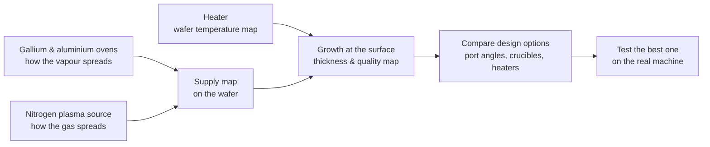
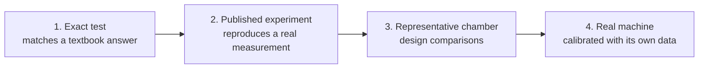

# GaN/AlN MBE digital twin

A laptop-scale computer model of a 200 mm molecular beam epitaxy (MBE) machine. Its purpose is to find design and operating changes that make grown layers more uniform across the wafer, before those changes are tried on the real machine.

This page explains the project in plain language. The technical details (code, solvers, commands, status by subsystem) are in the [developer guide](docs/DEVELOPER.md). The command behind every quoted number is in [docs/REPRODUCE.md](docs/REPRODUCE.md).

**Contents**
1. [The machine and the problem](#1-the-machine-and-the-problem)
2. [What the twin is](#2-what-the-twin-is)
3. [The gallium beam](#3-the-gallium-beam)
4. [Gallium on the 200 mm wafer](#4-gallium-on-the-200-mm-wafer)
5. [Nitrogen](#5-nitrogen)
6. [Wafer temperature](#6-wafer-temperature)
7. [How results are made trustworthy](#7-how-results-are-made-trustworthy)
8. [Where things stand](#8-where-things-stand)
9. [Glossary](#9-glossary)

## 1. The machine and the problem

**What MBE does.** MBE grows extremely thin crystal layers atom by atom. Here the layers are gallium nitride (GaN) and aluminium nitride (AlN), the materials in LEDs and fast power transistors.

**How it works.**
- A sealed chamber is pumped down to a near-perfect vacuum.
- Small ovens called **effusion cells** heat liquid gallium or aluminium until it evaporates.
- The vapour flies in straight lines across the chamber, like light from a lamp, and lands on a hot silicon wafer.
- There it meets nitrogen from a **plasma source** and forms the crystal.
- The wafer spins so that every point on it sees the sources from all sides.

*Schematic of the representative chamber, not to scale. The gallium cell sits 350 mm from the wafer centre, tilted 46° from the wafer's axis.*

**The problem: nonuniformity.** The sources sit off to the side, so the edge of a 200 mm wafer doesn't receive exactly the same supply as the centre, and the heater doesn't warm it perfectly evenly. The grown layer ends up slightly thicker in some places than others, and its properties vary too. We measure this with **range/mean**: the difference between the thickest and thinnest points, divided by the average. For example, 2 % means the thickest spot is 2 % thicker than the thinnest, relative to the average.

**The goal.** Reduce nonuniformity across the 200 mm wafer while keeping the required growth rate and material quality. Success will first be judged on thickness uniformity against an agreed baseline, and will count only once it is measured on the real machine. The [project outcome criteria](PHASE1_CHAMBER_PLAN.md#11-project-success-and-design-decisions) and [measurement protocol](docs/DATA_AND_VALIDATION_PLAN.md#demonstrating-wafer-uniformity-improvement) define how improvements will be assessed. The numerical targets will be set from baseline data.

## 2. What the twin is

A **digital twin** here is a set of physics simulations that together predict how evenly material arrives on, and grows on, the wafer. We can then change things on the laptop (where a source points, the heater design, oven temperatures) and see what improves the wafer. That is much cheaper than testing each change on the real machine.

**Why a "representative" chamber.** The real machine isn't built yet, and no manufacturer publishes full drawings. So we model a typical 200 mm GaN machine of the RIBER / Veeco class, with dimensions taken from published sources. That lets us compare design ideas now. Exact predictions for the real machine need its own drawings and measurements.

**How each part earns trust.** Every piece of physics goes through the same ladder before its results are used:

## 3. The gallium beam

**The crucible.** The oven holds liquid metal in a deep cup (the **crucible**). The vapour leaves the liquid surface, bounces off the hot cup walls, and comes out of the mouth as a spray, the **beam**. The cup walls shape that spray: a deep, nearly empty cup gives a narrower spray than a full one.

**The liquid stays level.** The cell is tilted toward the wafer, but liquid gallium stays level, like water in a tilted glass. That creates a limit. At the usual 46° tilt, a cup filled closer than about 37 mm to its mouth spills. As the charge is used up over a campaign, the level drops deeper into the cup.

*The "recess" is how far the liquid sits below the cup's mouth, measured along the cup's axis. The twin studies 40 mm (fresh), 70 mm and 120 mm (nearly empty).*

**When atoms collide.** At low oven temperatures the vapour is so thin that atoms never meet each other; they only hit walls. The simple model (**free-molecular**) assumes exactly that, and follows millions of virtual atoms bouncing through the cup. At real GaN growth speeds, though, the gallium vapour inside the cup is dense enough that atoms do collide, and that reshapes the spray. For that we use **SPARTA**, a free research program that simulates gas collisions (method: DSMC, see the [glossary](#9-glossary)).

**Checking against a real experiment.** In 1991 Gericke and colleagues (reference R07) measured the spray from a bismuth cell at three evaporation speeds. Faster evaporation means denser vapour, more collisions and a wider spray. The collision model follows all three measured shapes within about 1–2 %. The no-collision model misses by up to 20 %.

*Deposit across a flat plate in front of the cell, relative to the centre. Black: measurement. Blue: collision model with its statistical error. Orange: no-collision model.*

What this test settles and what it leaves open:
- **One tuned number.** Collisions depend on how "big" an atom is in a collision. For bismuth the test pins that size to 8–10 Å.
- **Open puzzle.** The model's absolute deposition rate is 7–15 % lower than measured in every case. This is not simulation noise, and its cause is still unknown. The spray *shape*, which is what uniformity depends on, is reproduced.

## 4. Gallium on the 200 mm wafer

With the beam model tested, we apply it to a gallium cell in the representative chamber at a real GaN growth speed (1 µm per hour). The model follows atoms from the liquid surface, through the cup, across the chamber and onto the spinning wafer.

**Unevenness grows as the cup empties.** At the standard 46° port, unevenness grows from about 2 % with a fresh charge to 8–10 % when the cup is nearly empty. The deeper the liquid, the narrower the spray, so the wafer edge gets less.

*Right panel: each line uses a different assumed gallium atom size. The dashed line is the no-collision model.*

**The biggest unknown: the gallium atom's size.** No published source gives the collision size of a gallium atom, so we try a range (2.5, 5.68 and 8 Å). It hardly matters for a fresh charge. For a nearly empty cup, bigger atoms mean more collisions, which widen the spray again. There the answer ranges from about 8 % to 10 %.

**Choosing the port angle.** Tilting the cell more steeply compensates for the narrowing spray. The best angle depends on the fill: about 48° for a fresh 40 mm charge, about 54° at 70 mm and about 58° at 120 mm. At its best angle each fill reaches roughly 1 %.

*Solid lines: collision model (atom size 8 Å) with statistical error. Dotted: no collisions. Red shading: angles where a fresh charge would spill. Grey band: values that finer simulation settings still move by up to about 0.7 points.*

What the angle study means:
- **No fixed angle is best for a whole campaign.** A fresh charge would spill beyond 48.2°, while an emptying cup prefers 54–58°. Choosing a port angle is a real design trade-off.
- **"About 1 %" is as precise as the optimum gets for now.** Repeating the best cases with finer time steps, finer grids and different random seeds moves the result between about 0.7 and 1.5 %. More of those checks are running.

**Keeping the growth rate constant.** As the cup empties, less vapour escapes, so the oven must run hotter to keep the growth rate. The no-collision model puts the increase at about 8.5 °C between 40 and 120 mm. With collisions, the rate actually delivered at those temperatures is 4 % below to 9 % above the target. So the twin now adjusts the temperature from the collision simulation itself, repeating until the delivered rate is within ±1.5 % of the target. Those runs are in progress.

**What these results are, and are not.** They compare design options on a representative chamber, with a known uncertainty and one clearly bracketed unknown (the atom size). They are not a thickness prediction for a specific machine. In the usual gallium-rich GaN recipe, thickness follows the nitrogen supply (next section).

## 5. Nitrogen

In the usual gallium-rich recipe, a thin excess film of gallium sits on the surface, and the crystal grows as fast as nitrogen arrives. So the **thickness map follows the nitrogen map**. What matters for the gallium cell is the **gallium-to-nitrogen ratio** across the wafer, which must stay gallium-rich everywhere.

**The nitrogen source.** The plasma source releases its gas through a plate with many small holes. Our model of that plate shows:
- **Hole shape sets the spread.** How the nitrogen spreads over the wafer depends mostly on the holes' shape (how deep compared with how wide). The plate's overall size barely matters.
- **The ratio can go either way.** Combining gallium and nitrogen maps can make the ratio across the wafer more even than the gallium alone, or less even, depending on the plate. A drawing of a real (or representative) plate is needed before settling where the gallium cell goes.

## 6. Wafer temperature

The wafer heater is modelled with **Elmer**, a free heat-flow simulator. It passes two exact tests: heat conduction, and heat radiation between two hot plates (within 0.25 °C).

The first published heater experiment we examined (R03) turned out to be a weak test. Its wafers sit off-centre on a large plate, and its measured temperature differences (2–6 °C) are close to its own ±2 °C measurement error. Its data are saved, and better heater experiments are being looked for before the 200 mm heater model is built.

## 7. How results are made trustworthy

- **Statistical error bars.** Collision simulations are statistical, like an opinion poll, so every result carries an error estimate from splitting the run into independent pieces. Important cases are rerun with another random seed, smaller time steps and finer grids.
- **A checked unevenness formula.** Turning a noisy simulated spray into one range/mean number needs a smoothing formula. Ours was tested against exact answers: it is off by at most 0.2 points, and its random scatter is 0.3–0.5 points.
- **Every result can be rerun.** Each run gets its own folder and records its full settings before it starts. Saved results carry a fingerprint of the exact code that produced them, and batch files spell out every setting.
- **Automatic tests.** About 120 automatic tests check the code; all pass. Every number is traced to a published source, and unknown or unexplained results are labelled rather than hidden.
- **The laptop stays safe.** Simulation output is read one snapshot at a time. At most 3 jobs run at once, and a new job starts only when at least 3 GB of memory is free.

## 8. Where things stand

| Part | Status |
|---|---|
| Gallium beam model | Tested against a real experiment (shape within 1–2 %); absolute rate 7–15 % low, cause unknown |
| Gallium on the 200 mm wafer | Fill and port-angle study done; final numerical checks and constant-growth-rate runs in progress |
| Nitrogen source | Hole-plate model built; needs a representative plate drawing |
| Wafer heater | Solver passes exact tests; needs a better published experiment, then the 200 mm model |
| Surface growth chemistry | Not started |
| The real machine | Needs its drawings and first measurements, which will turn the representative twin into its own twin |

**Next.**
1. Finish the gallium checks and the constant-growth-rate runs.
2. Find a representative nitrogen plate design and a sourced gallium atom size.
3. Design a crucible shape that keeps the spray steadier as it empties.
4. Find a stronger heater experiment.

**Side idea (optional, not on the main path).** Could an adjustable gallium oven keep the layer even as the cup empties? The best angle steepens from about 48° to 58° as the cup empties, and a full cup only spills at steep angles, so "start shallow, tilt steeper later" never spills. When the laptop is free, we'll compare three ways to do it:
- an oven that can tilt at its mounting;
- two gallium ovens at different angles, with their output share changing over time;
- a better-shaped cup.

Tilting a hot oven of liquid gallium has real engineering risks (sealing, spitting droplets, recalibration), and the comparison will list them. Details are in the [reference-chamber note](ref/notes/REFERENCE_CHAMBER.md#exploratory-non-essential).

## 9. Glossary

| Term | Meaning |
|---|---|
| Å (ångström) | 0.1 nanometre, about the size of an atom |
| Beam | The spray of vapour leaving a source |
| Crucible | The cup inside an effusion cell that holds the liquid metal |
| DSMC | Direct Simulation Monte Carlo: simulates a gas by following many sample atoms and letting them collide at random with the right probabilities |
| Effusion cell | The oven that evaporates the metal |
| Free-molecular | Gas so thin that atoms never collide with each other, only with walls |
| Gallium-rich growth | A recipe with slightly more gallium than nitrogen, so thickness follows the nitrogen supply |
| MBE | Molecular beam epitaxy: growing crystals from beams of atoms in vacuum |
| Range/mean | (thickest − thinnest) ÷ average: our measure of unevenness |
| Recess | How far the liquid surface sits below the crucible's mouth |
| Representative chamber | A typical machine built from published dimensions, standing in until the real machine's drawings exist |
| R03, R07, … | Reference numbers of published sources in the [reference library](ref/) |

Figures are drawn by `scripts/make_readme_figures.py` from the saved run records.
