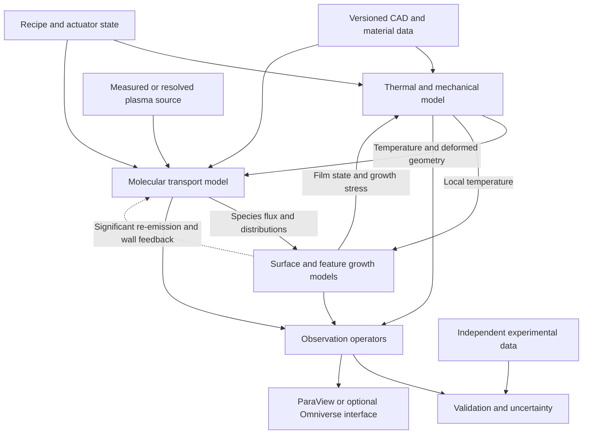

# MBE digital twin: accuracy-first architecture and validation plan

Date: 2026-09-13 (revised from the September 8 draft)  
Status: technical architecture for this GaN/AlN project. Stage A subsystem code exists (see the [developer guide](docs/DEVELOPER.md)); no integrated or experimentally validated chamber solver is established here.  
The current work order, laptop requirements and acceptance proposals are in [PHASE1_CHAMBER_PLAN.md](PHASE1_CHAMBER_PLAN.md). That plan governs initial scope where this broader architecture describes later capabilities. The original draft is preserved in [ref/archive](ref/archive/mbe_twin_2026-09-08_original.md). All proposed implementation paths are relative to this repository.

## 1. Decision and intended outcome

Build a machine-specific, three-dimensional, coupled chamber-and-growth model using specialist scientific solvers. Prioritize predictive accuracy, identifiable parameters, reproducibility and uncertainty over real-time speed. Use an open-source baseline so commercial licenses are optional. Use independently verified reduced models as limiting-case references where useful; no pre-existing simulator is required.

The initial candidate stack is FreeCAD for geometry, Gmsh for meshing, Elmer FEM for thermal and structural analysis, Molflow+ for collisionless molecular transport, Python for orchestration and calibration, and ParaView for scientific inspection. Each solver must pass a capability demonstration before becoming a dependency. SPARTA is a candidate for regions requiring collisional rarefied transport. Plasma and epitaxial surface models require a separate selection/development effort.

Omniverse is optional: use it for a spatial application, equipment animation and presentation of computed fields if those deliverables justify the integration. It does not replace the physical solvers. COMSOL is an optional commercial alternative for parts of the coupled physics workflow, not a requirement for accuracy.

The desired outcome is a model that predicts specified observables for a specified reactor and operating envelope, with documented uncertainty and independent experimental evidence. A detailed CAD scene, a converged numerical solution and a successful fit are each useful, but none alone establishes predictive validity.

### 1.1 Meaning of “as physically accurate as possible”

For this project, accuracy means reducing error in decision-relevant quantities through appropriate physics, measured boundary conditions, numerical convergence and independent validation. It does not mean resolving every atom in a full 8-inch wafer or selecting the most expensive solver at every scale.

Define a quantity of interest, its operating envelope and a decision tolerance before expanding a model. Resolve a neglected phenomenon when sensitivity studies, physical scale analysis or validation residuals show that it affects that quantity. Track uncertainty from geometry, properties, measurements, numerical methods and model form separately.

Use offline high-fidelity calculations as the reference. The released GaN/AlN workflow must run on the user's RTX 5050-class laptop, with actual CPU/RAM and performance to be confirmed. Any accelerated model needs its own and combined-workflow error assessment. The current plan allocates provisional numerical/reduction budgets and permits longer local reference jobs. External compute is optional. No standard-library-only or fixed millisecond requirement applies; speed cannot excuse failed accuracy criteria.

### 1.2 Maturity labels

| Label | Evidence required | Permitted description |
|---|---|---|
| Concept | Proposed equations and geometry | Design hypothesis |
| Numerically verified | Analytical/manufactured benchmarks and convergence checks | Verified numerical implementation |
| Calibrated | Parameters fitted to identified datasets | Calibrated within the fitting domain |
| Experimentally validated | Locked model predicts independent measurements to declared criteria | Validated for named quantities and envelope |
| Connected shadow | Time-aligned real-machine data updates model state | Connected monitoring/prediction system |
| Operational twin | Versioned machine state, validated predictions, uncertainty and maintained data connection | Operational twin within its declared scope |

These are project working definitions. Two-way control is not a prerequisite for the first useful twin. Experimental validation is quantity-specific: validated temperature does not imply validated defect density.

## 2. Scope and machine definition

### 2.1 Phase-1 boundary

Include the growth chamber, wafer and holder, substrate heater, source assemblies and shutters, plasma-source interface, chamber walls, shields, cooling/shrouds, pumping interfaces, diagnostic sightlines and growth-recipe execution. Include in-chamber preparation and interruptions where their physics is modeled.

The proposed first geometric domain excludes the transfer hub, load-lock, transfer robot, external anneal module, etch/PVD modules and upstream cleaning equipment. Their effects enter as initial wafer condition, surface contamination, template properties and boundary conditions. The user excluded the transfer and anneal modules on 2026-09-07. First release materials are binary GaN and AlN; patterned regrowth, alloys, doping and device behavior are later independently validated extensions.

### 2.2 Provisional hardware ledger

The supplied [MBE_Phase1_Proposal_v1.2.pptx](MBE_Phase1_Proposal_v1.2.pptx), slides 8, 11 and 19, supports the following design targets. The proposal is present; dimensioned CAD, selected-part specifications and installed-machine measurements are not. The [review](docs/PLAN_REVIEW.md) reconciles the proposal text with this plan. Vendor references in [ref](ref/README.md) are comparators, not evidence that those exact parts are installed.

| Item | Provisional requirement | Required confirmation |
|---|---|---|
| Wafer | 8-inch nominal diameter; actual radius unresolved | Distinguish 200 mm from exact 203.2 mm diameter; confirm thickness, bevel, bow, substrate/template stack and carrier |
| Heater | Multi-zone SiC; 1200 °C rating with measured object unspecified | Confirm wafer/holder/element rating, atmosphere, topology, power, zone count, dimensions, contacts and temperature limits |
| Sources | Ten positions; 3 Ga, 3 Al, Si, Mg and spares | Port inventory, orientations, source types, charge geometry and whether an In cell will be installed |
| Nitrogen source | RF, nominal 600 W and 13.56 MHz | Source architecture, delivered/absorbed power, flow range, aperture and species diagnostics |
| Vacuum | Turbo nominal ≥2000 L/s plus cryo and ion/TSP; base-pressure goal 10^-11 mbar | Species-specific curves, port conductances, cryosurface conditions and gauge location/sensitivity |
| Cooling | LN2 shrouds | Real surface temperatures, plumbing, thermal contacts and coverage |
| Diagnostics | 30 keV RHEED, band-edge thermometry, BFM and RGA | Exact instrument models, calibration, optical paths, response and sampling rates |
| Process | Proposal targets regrowth/doping/MQW; current twin starts with GaN and AlN binary layers | Material sequence, polarity, orientation and incoming template; later pattern/device validation scope |

An InGaN capability must not be inferred from a material model when the proposed source inventory does not identify an In source. Likewise, nominal 12-inch platen compatibility does not establish a validated 12-inch process model.

### 2.3 Questions the model should answer

1. What is the full wafer temperature field during stabilization, rotation, shutter changes, growth and cooling?
2. What species-resolved flux, angular distribution and energy distribution reaches each wafer location?
3. How do source settings, fill level, geometry, shutters and wall conditions change those distributions?
4. What thickness and composition maps result from a recipe, including interfaces and growth interruptions?
5. How do local patterned features change incorporation, morphology and regrowth continuity?
6. What dopant concentration is incorporated, and which additional assumptions are needed to infer electrical activation?
7. How do film stress and thermal mismatch deform the wafer and alter its thermal environment?
8. Which measured signals should the actual instruments report, and can discrepancies identify a model or machine change?

Rank these by the actual engineering decisions. Thermal/flux/thickness validation is the first milestone; detailed plasma, morphology, defects and electrical predictions have separate maturity gates.

## 3. Standalone implementation and reference models

The subsequently supplied sibling legacy simulator has now received a targeted static review. Its observed limitations and selective-reuse policy are recorded in [LEGACY_SIM_REVIEW.md](docs/LEGACY_SIM_REVIEW.md), with mandatory work-package checks in [Phase-1 section 9](PHASE1_CHAMBER_PLAN.md#9-lessons-from-the-supplied-legacy-simulator). This does not establish a runtime dependency or certify that implementation.

Build the project from the scoped requirements and evidence gates in this plan. No existing source tree, GUI, reactor card, audit or test suite is assumed to be present or required.

Use simple, independently verified reference models to check the high-fidelity implementation: radial thermal limits, unobstructed source geometry, rotation averages, mean-field growth laws, thin-film mechanics and synthetic diagnostic cases. Label each approximation and its validity domain. These references are verification aids, not experimental evidence.

Any optional third-party code or data reuse must record the source repository or archive, immutable revision, license, units, assumptions and independent acceptance tests before adoption. Passing imported regression tests does not establish machine accuracy.

Keep synthetic observations separate from literature reconstructions, digitized literature and direct machine measurements. Synthetic data may test inference and software behavior but must never count toward experimental validation.

Visualization, optimization, recipe previews and reports must consume the same versioned model results. Do not duplicate growth laws inside visualization scripts or user interfaces.

## 4. Physical assumptions and shortcuts to avoid

The following checks govern model selection and implementation. They are standalone requirements, not findings about an assumed existing codebase.

| Assumption or shortcut | Required treatment |
|---|---|
| Nitrogen-limited growth makes the thermal term vanish | In the stated law, net growth remains `J_N - R_dec(T)` when N-limited. It is approximately temperature-independent only if decomposition is negligible and the surface stays in the assumed regime. Incorporation, surface coverage and morphology can still vary with temperature. |
| Three identical Ga cells at different azimuths necessarily flatten the rotation-averaged radial profile | For identical geometry differing only by azimuth and complete uniform rotation, each has the same radial average. Their sum changes amplitude, not its normalized radial shape. They can reduce instantaneous azimuthal modulation; different radial/aim geometry can change the radial profile. |
| Dopant concentration obtained by dividing flux by growth rate and site density is in cm^-3 | If incorporated dopant flux is in atoms cm^-2 s^-1 and normal growth velocity is in cm s^-1, concentration is flux divided by velocity. Dividing again by cation-site density gives a dimensionless site fraction. |
| Total chamber pumping speed is the sum of pump nameplate speeds | Conductance, species, temperature and geometry matter. Series port conductance reduces effective speed; combine branches only after reducing each to the same chamber reference. Cryopump performance depends on temperature and accumulated loading. |
| 600 W or a flow-to-flux power law establishes active-N delivery | Generator power is not necessarily absorbed plasma power. Active species, wall loss and extraction must be measured or modeled. A fitted response map is an explicitly bounded empirical model. |
| A band-edge thermometer is simply true temperature plus noise | Model the absorption-edge measurement, substrate/film optical response, spectral fit and instrument calibration. It differs from thermal-emission pyrometry; determine which layer the actual configuration probes. |
| N-on interruption means exactly zero material loss | Nitrogen can suppress decomposition, but zero loss is a hypothesis requiring evidence under the chosen conditions. Track signed growth/etching and surface inventories. |
| MBE being hydrogen-free means no hydrogen or compensation model is needed | Absence of an intentional hydrogen precursor is not proof of zero background hydrogen, contamination or compensating defects. Separate incorporated dopants from carriers. |
| Negative thickness increments make layer removal exact | Removal must identify the exposed material and its stored stress/composition. Do not subtract material indiscriminately from a multilayer stack. |
| A single center sensor fully verifies multi-zone temperature control | A calibrated model may infer unmeasured states, but observability and uncertainty must be demonstrated. One measurement does not independently validate the full wafer field. |
| Programmed base pressure and uniformity targets are validation tests | These are targets. Validation compares predictions against independent measurements, including failures to meet the target. |

Band-edge measurement interpretation is supported by the instrument manufacturer's description of absorption-edge fitting and substrate-specific calibration, rather than a generic emissivity-only model. See [k-Space band-edge measurement](https://k-space.com/product/ksa-ice/).

Vapor-pressure coefficients, controller gains, plasma response, Mg barriers, emissivities and stress criteria require a units-and-provenance audit before use. Example or inherited values are not verified constants.

## 5. Software choices and adoption gates

### 5.1 Open-source baseline

| Tool | Verified general capability | Intended use | Adoption test and remaining gap |
|---|---|---|---|
| FreeCAD | Open-source parametric CAD | Machine assembly and geometry variants | Import an actual STEP assembly, retain dimensions and component identity, export clean solver geometry. [Project](https://github.com/FreeCAD/FreeCAD) |
| Gmsh | Open-source 3D finite-element mesh generator with CAD support | Tagged volume/surface meshes | Demonstrate stable physical-region tags and convergent wafer/shield meshes after geometry edits. [Project](https://gmsh.info/) |
| Elmer FEM | Heat transfer, mechanics and electromagnetics; radiation models documented | Chamber thermal model and initial thermoelastic model | Run obstructed enclosure radiation, contact conduction and anisotropic material benchmarks. Confirm required features in the selected release. [Project](https://github.com/ElmerCSC/elmerfem), [models manual](https://www.nic.funet.fi/index/elmer/doc/ElmerModelsManual.pdf) |
| Molflow+ | Open-source test-particle Monte Carlo for molecular-flow vacuum analysis | Chamber vacuum and candidate beam transport | Demonstrate finite aperture, angular emission, absorbing wafer, aperture/obstruction and absolute-flux normalization. Check automation and dynamic-geometry workflow. [CERN description](https://cern-courier.web.cern.ch/a/tracing-molecules-at-the-vacuum-frontier/), [algorithm](https://molflow.docs.cern.ch/guide/molflow/general/attachments/molflow_algorithm.pdf) |
| SPARTA | Open-source DSMC, including configurable surface interactions | Collisional rarefied regions if needed | Establish local rarefaction and relevant collision/reaction data; prove free-molecular and collisional benchmarks. [Project](https://sparta.github.io/), [surface reactions](https://sparta.github.io/doc/surf_react) |
| Python | Orchestration language | Input validation, execution, coupling, calibration and reports | Pin interpreter/packages; establish SI conversions, deterministic manifests and restart tests |
| ParaView | Open-source scientific post-processing | Field inspection, maps, sections and time histories | Verify units, coordinate transforms, color scales and missing-data rendering. [Project](https://www.paraview.org/) |

Molflow supports directional-source approaches, but a generic vacuum tally is not automatically a calibrated deposition prediction. Its source-angle and normalization behavior must be exercised explicitly. The developer discussion points to angular maps for molecular-beam sources: [source discussion](https://molflow-forum.web.cern.ch/t/defining-a-molecular-beam-source-in-molflow/633).

Elmer's manual documents radiosity/Gebhart approaches and view-factor shadowing. This establishes a credible candidate, not proof that the target assembly or every spectral/contact feature has already been demonstrated. Keep this distinction in solver-selection records.

### 5.2 Optional tools and unresolved selections

| Option | Reason to consider | Constraint |
|---|---|---|
| FEniCSx | Custom PDE formulations and specialized constitutive models | Requires formulation and software work; not a turnkey RF plasma or epitaxy solver. [Project](https://fenicsproject.org/) |
| preCICE | Partitioned coupling, data mapping and implicit iteration | Adapters are project work unless demonstrated; mapping choice must match physical quantities. [Mapping](https://precice.org/configuration-mapping), [coupling](https://precice.org/configuration-coupling) |
| FEDM or another open discharge framework | Starting point for plasma transport/reaction development | Evaluate RF electromagnetic coupling, nitrogen chemistry and actual source regime before adoption. [Research description](https://arxiv.org/abs/2212.01288) |
| Quantum ESPRESSO | First-principles input to selected surface energetics | Research task with convergence, surface-structure and functional uncertainty; not a chamber solver. [Project paper](https://arxiv.org/abs/0906.2569), [terms](https://quantum-espresso.org/Doc/pw_user_guide/node5.html) |
| COMSOL | Integrated commercial thermal, molecular-flow and plasma workflows | License/module cost; still needs machine-specific physics and validation. [Licensing](https://www.comsol.com/products/licensing), [molecular flow](https://www.comsol.com/molecular-flow-module), [plasma](https://doc.comsol.com/6.3/doc/com.comsol.help.plasma/plasma_introduction.02.02.html) |
| Omniverse | OpenUSD-based application and rendered machine context | Optional front end; no demonstrated turnkey epitaxial process solver. [Overview](https://www.nvidia.com/en-us/omniverse/), [PhysX scope](https://developer.nvidia.com/physx-sdk) |
| PhysicsNeMo | Later surrogate modeling of expensive validated simulations | Separate training and out-of-domain validation; acceleration does not improve the reference physics automatically. [Project](https://developer.nvidia.com/physicsnemo) |

### 5.3 Cost, licensing and portability

The baseline can avoid paid software licenses. This does not eliminate engineering labor, hardware/HPC, measurement, storage or vendor-data costs. Record the exact license and release of every adopted dependency; the table is a capability shortlist, not a redistribution analysis.

Omniverse is outside the initial dependency set. Check its then-current license and hardware requirements if selected; this plan makes no current price or entitlement claim. [Vendor licensing](https://docs.omniverse.nvidia.com/ov/latest/common/NVIDIA_Omniverse_License_Agreement.html).

Use a Linux execution environment as the initial reproducibility candidate, with Windows CAD/viewing where convenient. Verify native/WSL/container support for selected versions before promising a one-command installation. Start CPU-first for the initial solver demonstrations; choose GPU or cluster hardware only after measured memory, runtime and solver-support requirements are available. The physics stack does not require Omniverse or an RTX renderer.

## 6. Geometry and physical configuration

### 6.1 Authoritative model

Maintain separate authoritative CAD, simulation geometry and display geometry. Preserve a mapping between them. A display mesh may omit small features; a simulation mesh may omit them only after their thermal, conductance, shadowing or contact effect is evaluated.

Register each component with stable identity, material, transform, dimensions/tolerances, revision and provenance. Never use transient CAD face numbers alone as physical boundary identifiers. Geometry updates must produce a diff of affected source directions, contacts, enclosure openings, pump ports and wafer clearances.

### 6.2 Required domains

- Wafer volume or a validated thin-shell representation, bevel and actual backside treatment.
- Holder, pocket, clips/supports, spindle interface and any real contact/gap regions.
- Heater elements/zones, insulation, supports and radiative shields.
- Source apertures, crucible/cell geometry needed for emission and thermal effects, shutters and ports.
- Shrouds, chamber walls, viewports and openings to external thermal boundaries.
- Pump interfaces at meaningful reference planes; downstream conductance model or explicit duct geometry.
- Plasma-source internal domain only when its independent model is introduced.
- Patterned feature subdomains with crystal orientation, facet identity and initial surface condition.

### 6.3 Geometry verification

Check units, watertightness where required, inward/outward normals, duplicate/intersecting surfaces, thin gaps, contact pairs and unintentional openings. Compare selected dimensions with drawings and metrology. Verify that a known ray intersects the intended shutter/wafer surfaces and that a simple radiation enclosure closes its energy balance.

Keep chamber and wafer coordinate frames explicit. A rotating wafer requires both the fixed laboratory field and material-point history. Store rotation direction, phase, speed and time origin. Do not average away short shutter events or nonlinear surface response without a comparison to resolved rotation.

## 7. Thermal and mechanical physics

### 7.1 Thermal equations and boundaries

In a stationary solid domain, solve a suitable form of:

```text
rho * cp(T) * dT/dt = div(k(T) grad(T)) + q_volume
```

Use tensor conductivity where material anisotropy matters. Moving/rotating formulations must account consistently for material motion or transform boundary forcing into the material frame. Avoid inserting gas convection into an ultra-high-vacuum gap by default; select gas heat transport from the local regime.

Heating inputs should be measured electrical power or modeled electrical dissipation where possible. Prescribed heater temperature is acceptable as a measured boundary case, but cannot validate the heater's own power response. Include conduction through supports, actual inter-zone conduction and contact resistance. Temperature-dependent heat capacity and properties are needed over the full heating/cooling range.

For an opaque diffuse-gray enclosure, the radiosity relations provide a reference formulation:

```text
J_i = epsilon_i * sigma * T_i^4 + (1 - epsilon_i) * G_i
G_i = sum_j(F_ij * J_j)
Q_i,out = A_i * (J_i - G_i)
```

Enclosure openings need explicit boundary treatment. Verify `A_i F_ij = A_j F_ji` and enclosure closure within numerical error. Temperature is in kelvin. Surface condition, deposited coatings, spectral selectivity, specular reflection and wafer semitransparency can invalidate the diffuse-gray approximation; assess their effect rather than assuming polished metals and semiconductor wafers are opaque gray bodies.

The thermal energy ledger must include electrical input, stored energy, radiation/conduction to cooling boundaries and any physically significant gas/particle energy exchange. Do not count particle energy in both plasma-to-wafer and molecular heat-transfer terms.

### 7.2 Thermal parameter intake

For each material and interface obtain `rho`, `cp(T)`, `k(T)`, optical/radiative properties and contact conductance with source and uncertainty. Measure cooling boundary temperatures; LN2 supply does not prove every shroud surface is at its boiling temperature. Track viewport/shroud deposition and heater aging as configuration changes.

Calibrate contact/emissivity parameters with multiple powers, transient segments and spatial observations. Freeze independently measured dimensions rather than allowing geometry to absorb material-property errors.

### 7.3 Mechanics and growth stress

Use equilibrium or dynamic mechanics appropriate to the time scale. For a thermoelastic model:

```text
div(stress) + body_force = 0
stress = C : (strain - thermal_strain - growth_eigenstrain - inelastic_strain)
```

Define reference temperature, crystal orientation, elastic tensor, thermal expansion and boundary constraints. Separate thermal mismatch from growth-induced stress and relaxation. Wafer bow alone may not uniquely identify all of them.

Thin films may use shell/layer/eigenstrain representations instead of nm-scale volume elements across the whole wafer, provided limiting-case and refinement tests support the quantities of interest. Stoney-type formulas remain useful verification cases within their small-deflection/thin-film assumptions.

Add plasticity, dislocation motion, slip or cracking only with relevant constitutive parameters and validation. An empirical stress threshold is a risk indicator, not a prediction of defect evolution. Feed displacement back into thermal/beam geometry when sensitivity establishes a material effect; assess coupling convergence.

## 8. Molecular transport, sources and vacuum

### 8.1 Regime selection

Estimate local Knudsen number `Kn = lambda/L` using relevant species, pressure, temperature, collision cross sections and geometric/gradient scales. The chamber, source interior and aperture need not share one regime. Collisionless test-particle transport is appropriate only where intermolecular collisions are negligible for the requested observable. Use DSMC or another justified kinetic treatment where they are not.

Do not infer the operating regime from the base-pressure specification alone. Plasma-on pressure and near-source density can differ substantially. Charged particles additionally require electromagnetic treatment; neutral DSMC is not a complete plasma model.

### 8.2 Absolute species flux

Use emitted particle rate and source distributions to obtain an absolute arrival flux in particles m^-2 s^-1. Record particle species, atomic multiplicity, angular/energy distribution and wall interaction model. A normalized beam shape is insufficient for growth prediction.

For an ideal equilibrium effusing surface, a useful reference is:

```text
number_flux = alpha * P_vap(T) / sqrt(2*pi*m*k_B*T)
```

Here pressure is Pa, mass is kg per emitted particle, and the result is particles m^-2 s^-1. This is a limiting model: crucible transport, source geometry, material activity, temperature gradients and transmission alter actual delivery. Fit or measure the effective source output rather than treating an unverified vapor-pressure table as a complete cell model.

Model finite source area, source orientation, charge/fill changes, shutter obstruction and the wafer's time-dependent pose. Preserve distributions required by the surface model; a scalar flux cannot represent an energy-dependent sticking law without an explicitly justified averaging step.

### 8.3 Wall and pump behavior

Assign species- and condition-dependent reflection, sticking, desorption/residence and recombination behavior. Independent species solves are valid only if the selected physics permits their separation; coverage-dependent interactions require coupled wall inventories. Track where deposited material goes so the chamber species balance closes.

For a simple molecular-flow branch, use the conductance reference:

```text
1/S_effective = 1/S_pump + 1/C_port
```

Combine effective parallel branches at a common reference location. Resolve larger conductance networks or full geometry as needed. A lumped isothermal volume obeys `V*dP/dt = Q - S_effective*P`; use this as a benchmark, not a substitute for spatial transport when gradients matter.

Distinguish number density, isotropic-equivalent pressure, gauge response and directional molecular flux. A gauge in a directed beam does not directly measure a universal chamber thermodynamic pressure. Specify gas correction factors and gauge orientation/location.

### 8.4 Units that must be tested

```text
1 mbar = 100 Pa
1 Torr = 133.322368421... Pa
1 L/s = 1e-3 m^3/s
1 sccm at 101325 Pa and 273.15 K = 1.68875e-3 Pa*m^3/s
                                   = approximately 0.012667 Torr*L/s
```

Record the mass-flow controller's actual standard conditions. For illustration only, 2 sccm at 273.15 K standard conditions with 2000 L/s effective speed gives approximately `1.27e-5 Torr` if throughput and pumping speed refer to that same gas temperature. For gas at 300 K, ideal-gas particle conservation gives `P = Q_standard*(300/273.15)/S_effective`, approximately `1.39e-5 Torr`. Neither is a reactor prediction: effective speed, other loads and gas temperatures are unresolved. Use number throughput internally to avoid mixing standard and actual volumetric flow.

### 8.5 Transport acceptance

Demonstrate free-flight aperture/view-factor limits, complete shutter blocking, partial shadowing, expected geometric scaling and particle conservation. Compare angle-map and simpler source distributions. Report Monte Carlo confidence intervals using independent seeds or an appropriate statistical estimator; increase samples until uncertainty in the requested wafer-map quantities meets the error budget.

For DSMC, independently refine cells, time steps and particle population against collision/gradient scales. Agreement between two solvers is useful corroboration but cannot replace experimental evidence when they share uncertain boundary inputs.

## 9. Nitrogen plasma source

### 9.1 Separate source and chamber domains

Treat the plasma source as an independently testable subsystem. Its output boundary is species-resolved particle flow, angular distribution and energy distribution at an aperture/interface, together with heat and gas load. Transport those outputs into the chamber without counting the same loss twice.

The source model may require RF electromagnetic fields, electron energy distribution or closure, ion/electron transport, neutral chemistry, metastables, wall recombination, gas heating and extraction effects. Select fluid, kinetic or hybrid treatment from the actual source regime and quantities of interest. A generic PIC code or fluid discharge framework is not automatically suitable for an RF nitrogen source.

### 9.2 Two explicitly labeled maturity paths

**Measured-boundary path:** characterize output versus power, flow and source state, and interpolate within that measured envelope with uncertainty. This can enable accurate downstream chamber predictions before the internal plasma model is mature. It does not predict behavior of an unmeasured source redesign.

**Resolved-source path:** implement electromagnetic/transport/chemistry physics, verify individual equations and reaction bookkeeping, and validate outputs across held-out conditions. Treat this as a separate research work package with its own verification and validation gates.

Required intake includes coil/source geometry, frequency, forward/reflected power, matching behavior, source pressure/flow, temperature, wall materials and relevant diagnostic data. Delivered RF power and absorbed power must be distinguished.

No default assumption that every nitrogen-bearing species is equally growth-active is permitted. Specify atomic versus molecular flux, metastable/ion contributions and the convention used for “active N” and V/III. Do not encode “ion-free” as a physical fact without evidence.

## 10. Surface growth, alloys, doping and patterned regrowth

### 10.1 Surface state and conservation

At each wafer location or representative patch, consume temperature and species arrival distributions. Track the surface inventories needed for the chosen regime: adatoms, coverage/reconstruction, excess metal, incorporated material and desorbed/re-emitted species.

A schematic inventory equation is:

```text
d(surface_inventory_s)/dt = arriving_s - incorporated_s - desorbed_s
                          + surface_transport_s + reaction_sources_s
```

All terms must use compatible particle/area/time units and conserve elements and charge where relevant. Assign outgoing species back to chamber transport if their contribution is significant; otherwise quantify and record the neglected feedback.

Normal growth velocity follows incorporation and material atomic volume. State whether a “monolayer” means atomic plane, bilayer or another crystallographic unit. A nominal `0.259 nm` GaN bilayer conversion is not a universal conversion for every material, orientation or strain state.

Growth interruptions need signed material evolution and an exposed-layer ledger. Enforce nonnegative inventories while allowing physically supported etching. Shutter closure does not automatically erase an excess-metal adlayer or cell thermal history.

### 10.2 Fidelity hierarchy

1. Calibrated mean-field surface reaction equations for wafer-scale thickness and composition.
2. Representative kMC patches at selected local conditions to test morphology and effective kinetic closures.
3. Feature-scale facet evolution and diffusion for patterned regrowth.
4. Targeted electronic-structure calculations or additional experiments for influential uncertain barriers.

The hierarchy is a coupling strategy, not a guarantee that higher levels automatically improve accuracy. A poorly specified atomistic event catalog can be less predictive than a calibrated lower-order law within its measured domain.

For kMC, validate rates, detailed-balance requirements for reversible subsets, event selection, finite patch size, boundary conditions and stochastic uncertainty. Compare accelerated and unaccelerated small cases. Changing thermally activated rates without equivalently justified coarse-graining changes their competition with deposition. Any rate-scaling acceleration must therefore demonstrate that it preserves the relevant physical kinetics. Multiscale epitaxy methods provide methodological background: [multiscale kMC](https://arxiv.org/abs/cond-mat/0504272).

### 10.3 Alloys and doping

Track elemental incorporation separately. Composition is based on incorporated cation counts, not simply source setpoint ratios. Include competition, segregation and memory only to the degree supported by the chosen model and data. Optical wavelength additionally depends on strain, confinement, temperature and electronic structure; do not infer validated device emission from a composition map alone.

For dilute dopants in locally steady growth:

```text
C_dopant [atoms/cm^3] = J_incorporated [atoms/cm^2/s] / v_normal [cm/s]
x_dopant [dimensionless] = C_dopant / N_cation_sites [sites/cm^3]
```

This relation is invalid as a steady concentration formula when velocity approaches zero; use surface inventory and incorporation during interruptions. Distinguish elemental incorporation (e.g. SIMS) from free carriers (e.g. Hall), compensation, ionization and mobility. Sheet resistance requires a supported electrical model and layer geometry. Do not equate Mg concentration with hole density.

### 10.4 Patterned regrowth and defects

Represent facet orientation, feature dimensions, local angle-dependent flux and surface diffusion between relevant facets. Boundary conditions come from the chamber model at the feature's location. Establish representative-feature selection and convergence with pattern spacing/size; a flat-wafer radial average cannot establish regrowth sidewall coverage.

Track initial template polarity, strain, dislocations, roughness and contamination as input uncertainty. Pressure exposure is an exposure metric; conversion to interface Si/O or electrically active traps requires chemistry and independent measurements. Defect density and polarity inversion must remain empirical indicators until a validated mechanism and dataset support predictive claims.

## 11. Instruments, controls and machine connection

### 11.1 Observation operators

Every comparison uses an observation operator that converts model state into what a real instrument measures, including spatial averaging, timing and calibration.

| Instrument/data | Required treatment |
|---|---|
| Band-edge thermometry | Spectral absorption-edge response, substrate/film calibration, optical path, spot and fit uncertainty |
| Emission pyrometer, if present | Spectral radiance, emissivity/transmission, reflected radiation and response |
| BFM/BEP | Position, angular acceptance, species sensitivity, insertion/shadowing and calibration to particle flux |
| RGA | Species-to-mass-channel response, fragmentation, sensitivity, pumping/location and background |
| RHEED | Beam energy/geometry, footprint, surface structure, scattering approximation, camera gain/background and timing |
| Thickness/composition maps | Registration, spatial resolution, fitting uncertainty and edge exclusion |
| Bow/curvature | Reference state, sign, spatial fitting convention and measurement temperature |
| SIMS/Hall/AFM/XRD | Depth/lateral resolution and what each observable can actually constrain |

At 30 kV the relativistically corrected electron wavelength is approximately 0.0698 angstrom. Checking this verifies a unit/geometry calculation; it does not validate RHEED intensity or the surface morphology model. Dynamical diffraction is a separately scoped accuracy upgrade when quantitative diffraction is a required output.

### 11.2 Control behavior

Model commanded power/setpoints, sensor readings, controller state, actuator saturation and delays separately from true simulated temperature/flux. Controller tuning must use identified plant dynamics and actuator/sensor constraints; generic gains are initial hypotheses.

For multi-zone control, evaluate the observability and sensitivity of the measured outputs to zone states. Use additional spatial measurements or report uncertainty in unobserved edge states. Do not provide a controller access to true simulated fields that the actual machine cannot sense unless the mode is explicitly an idealized design study.

Use an offline/read-only connection initially. Real interlock thresholds and authority come from the machine control specification, not illustrative thresholds in this repository. Simulation interlocks support testing; actual equipment protection remains in the validated machine control system. Live command integration is a separate engineering scope.

### 11.3 Time and data integrity

Store device time, acquisition time, monotonic simulation time, clock-offset estimates, sampling interval and quality flags. Handle missing/stale readings explicitly. Preserve raw data and calibration versions. Separate measured, estimated, predicted and commanded fields in APIs and displays.

A model can be useful offline before connection. After connection, test replay and out-of-order/missing-data handling before interpreting residuals as machine faults.

## 12. Coupling architecture



### 12.1 Coupling rules

- Begin with file-based, reproducible subsystem exchange for benchmark cases. Introduce runtime coupling when its necessity is demonstrated.
- Temperature/displacement mapping must preserve the appropriate intensive field behavior. Integrated particle number, heat and force must conserve their totals. Flux densities require area-aware integration/mapping; do not assume a conservative nodal sum conserves an area integral.
- Preserve coordinates, normals, area weights, species identity and time intervals. Check transforms with analytic fields and deliberately nonmatching meshes.
- Use subcycling for separated time scales. Assess macro-step and sub-step errors independently. Resolve shutter/rotation events without stepping across them unnoticed.
- Iterate strongly coupled temperature/bow/geometry feedback to a declared residual or justify a one-way approximation through sensitivity and convergence comparisons.
- Stochastic transport noise must be distinguished from coupling residual. Fixed/common random samples during iteration may reduce numerical noise, but independent-seed uncertainty must still be assessed afterward.
- On failure, reject or mark the step, checkpoint and expose the reason. Never silently report a stale field as a newly converged result.

### 12.2 Minimum exchanged fields

| Producer → consumer | Data | Required checks |
|---|---|---|
| Geometry → all | Component IDs, mesh, transforms, normals and areas | Units, revision and region completeness |
| Thermal → surface | Wafer temperature versus position/time | Mapping and time interpolation |
| Mechanics → transport/thermal | Displacement, normals, gaps | Geometry validity and update threshold |
| Source → transport | Species rates and angle/energy distributions | Normalization and atoms-per-particle convention |
| Transport → surface | Arrival flux and required distributions | Area-integrated species balance |
| Surface → mechanics | Thickness, composition and eigenstrain/stress history | Exposed-layer identity and consistent reference state |
| Surface/walls → transport | Re-emission, sticking or coverage updates | No double counting and elemental conservation |
| State → diagnostics | Physical fields plus observation metadata | Measured versus true-state separation |

Do not require every feedback on the first run. Record disabled couplings and their estimated error contribution in the run manifest.

## 13. Data contracts and proposed repository layout

### 13.1 Conventions

Use SI internally: m, s, K, Pa, W, kg, particles m^-2 s^-1 and concentrations m^-3. Convert to cm^-3, Torr, sccm, nm and degrees Celsius only at explicit boundaries. Electron energies may use eV with declared conversion. V/III definitions must specify active atomic-N equivalence and which cation species are included.

Use JSON/YAML for configuration with schema validation, HDF5 or another documented array format for large numerical data, and VTK-compatible output for visualization. Treat formats as candidates until solver export/import demonstrations pass. CAD/mesh copies carry checksums and stable physical tags.

Parameters need value, unit, provenance type, source, uncertainty/distribution, validity interval, calibration dataset IDs and revision. Distinguish `measured`, `literature`, `digitized`, `fitted`, `prior`, `synthetic` and `derived`. Preserve provenance chains for derived values.

Example metadata contract (illustrative; not an implemented schema):

```json
{
  "schema_version": "0.1",
  "run_id": "thermal_benchmark_001",
  "mode": "offline",
  "machine_revision": "proposal_unconfirmed",
  "geometry_sha256": null,
  "solver_versions": {},
  "time_unit": "s",
  "coordinate_frame": "chamber",
  "parameters": {
    "wafer_radius": {
      "value": null,
      "unit": "m",
      "provenance": "prior",
      "source": "Proposal 8-inch designation; resolve 200 versus 203.2 mm and actual drawings during intake",
      "uncertainty": null
    }
  },
  "validation_status": "not_validated",
  "disabled_couplings": [],
  "warnings": ["Illustrative metadata; geometry and uncertainty unresolved"]
}
```

Production execution must reject missing required geometry hashes, versions and units. Unknown uncertainty is not zero uncertainty. An exploratory mode may permit incomplete priors while labeling outputs accordingly.

### 13.2 Layout

```text
mbe-digital-twin/
  README.md
  pyproject.toml
  docs/
    architecture.md
    physics/                 # equations, assumptions and validity envelopes
    decisions/               # solver adoption and scope records
    validation/              # protocols and released evidence reports
    licenses/                # dependency and input-data inventory
  schemas/
  machines/<machine_id>/
    assembly.yaml
    materials/
    sources/
    diagnostics/
  geometry/
    cad/                     # authorized source assets or tracked references
    simplifications/         # scripted transformations and justification
    meshes/                  # generation scripts; generated meshes by policy
  src/mbe_twin/
    units/
    geometry/
    solvers/                 # adapters, not copies of solver source trees
    coupling/
    surfaces/
    diagnostics/
    recipes/
    calibration/
    validation/
    io/
  cases/
    verification/
    synthetic/
    calibration/
    validation/
  data/
    manifests/               # checksums and authorized locations of raw data
    processed/               # reproducible transformations or small fixtures
  tests/
  environments/              # pinned versions and build instructions
  scripts/
  results/                   # generated; generally excluded from ordinary Git
```

This is a proposed layout, not a statement that these files exist. Create only directories needed for the first implementation slice. Keep large solver outputs outside ordinary Git; retain manifests, checksums and reproducible inputs. Use LFS selectively for authorized CAD/project assets, subject to storage quotas. A fresh checkout plus accessible input artifacts must be sufficient to reproduce a released run.

### 13.3 Reuse policy

External component reuse is optional and must satisfy Section 3. Keep solver adapters and project APIs independent of external GUIs and application internals. Extract a shared package only after multiple consumers demonstrate a stable common interface. This plan requires no migration or deletion of another project.

## 14. Verification, validation and uncertainty plan

### 14.1 Separate the evidence types

**Code verification:** equations and algorithms are implemented correctly, using analytical/manufactured solutions and independent identities.

**Solution verification:** the particular result is sufficiently converged in mesh, time, nonlinear iteration, coupling iteration and stochastic sampling.

**Calibration:** uncertain parameters are estimated from specified observations.

**Experimental validation:** the locked model predicts independent observations within predeclared tolerances and uncertainty expectations.

**Operational monitoring:** later runs remain within the validated envelope and residuals have not drifted materially.

Uncertainty and traceability are integral to computational measurement; see [NIST virtual measurement](https://www.nist.gov/itl/virtual-measurement) and [measurement uncertainty](https://www.nist.gov/itl/sed/topic-areas/measurement-uncertainty). The detailed gates below are project proposals, not claimed external standards.

### 14.2 Verification matrix

| ID | Test | Failure it detects |
|---|---|---|
| V01 | Kelvin/Celsius, pressure, flow, concentration and monolayer conversions | Hidden scale and species-count errors |
| V02 | Conduction slab and transient cooling with known solution | Thermal discretization and capacity errors |
| V03 | Two-surface radiation and enclosure reciprocity/closure | Radiation sign, units, visibility and view-factor errors |
| V04 | Contact-resistance limit and thermal expansion of a free body | Interface and mechanical boundary mistakes |
| V05 | Thin-film curvature within analytical assumptions | Stress sign and layer/reference-state errors |
| V06 | Aperture/free-flight benchmark and fully blocked shutter | Transport normalization and shadowing errors |
| V07 | Well-mixed pump-down and series conductance | Pressure-unit and effective-speed errors |
| V08 | Identical sources shifted in azimuth under complete rotation | Incorrect radial averaging claims |
| V09 | Constant-flux deposition with exact integrated thickness | Time integration and deposition conversion errors |
| V10 | Dopant flux/velocity concentration balance | Concentration versus site-fraction confusion |
| V11 | Surface event/inventory conservation and small kMC rate case | Event selection, kinetic scaling and mass loss |
| V12 | Nonmatching-mesh transfer of constant fields and conserved totals | Coupling interpolation/integration errors |
| V13 | Restart across shutter event with identical input histories | Missing state and time discontinuities |
| V14 | Sensor response to prescribed synthetic field | Incorrect observation timing/averaging |
| V15 | Synthetic parameter recovery with deliberate degeneracy | False confidence in nonidentifiable fits |

Each case records input, expected result or convergence behavior, tolerance, rationale and solver version. Synthetic recovery verifies fitting machinery; it does not demonstrate physical truth.

### 14.3 Numerical acceptance budgets

Provisional engineering targets for initial demonstrations:

- Aim for numerical error below 20% of the eventual application tolerance for each primary observable.
- Aim for closed-system energy/particle balance residual below 0.5% of a stated characteristic throughput, with absolute tolerances near zero flow.
- Compare at least three systematic mesh/time/sample levels where practical; seek an asymptotic trend rather than declaring convergence from one unchanged number.
- Assess local maps and peaks as well as global averages. A converged average can hide unconverged edge gradients.
- For Monte Carlo observables, report sampling uncertainty and use sufficient independent evidence for the claimed interval. Do not equate raw sample count with independent samples.
- Record failures and nonconvergence explicitly. Do not increase the permitted error after seeing an unfavorable validation result without creating a new protocol/model revision.

These targets are not achieved results. Replace them with documented budgets based on the eventual measurement resolution and engineering decision. A near-zero global residual does not prove the correct local physics.

### 14.4 Experimental campaign

| Campaign | Calibration observations | Independent validation | Main inference |
|---|---|---|---|
| Geometry/material intake | Dimensions, properties, contact/optical estimates | Independent dimensions or inspection | Configuration uncertainty |
| Thermal | Several zone powers, equilibrium fields and transient segments | Held-out power combination and ramp/rotation case | Wafer temperatures and heater response |
| Each source | Flux versus temperature, spatial maps and shutter transients | Held-out setpoint/fill/pose condition | Absolute beam delivery and response |
| Vacuum | Pump-down, gas-on/off, gauge/RGA histories | Held-out flow or pumping configuration | Conductance and species/load behavior |
| Nitrogen | Source diagnostics and growth-based constraints with uncertainty | Held-out power/flow pair | Active-species output within domain |
| Binary growth | Temperature/flux recipe series with thickness/morphology | Entire held-out wafer runs | Growth law and regime boundary |
| Alloys | Composition/depth and thickness data | Held-out composition/temperature recipe | Competitive incorporation and memory |
| Doping | SIMS plus independently interpreted electrical data | Held-out flux/temperature/layer run | Incorporation and separate activation model |
| Mechanics | Curvature during/after selected stacks | Different held-out stack/cooldown | Stress and deformation |
| Patterned regrowth | Feature-resolved cross-sections/chemistry | Held-out feature geometry and location | Facet growth and interface behavior |

Do not use individual pixels from the same wafer as if they were independent validation experiments after fitting other pixels from that wafer. Split by physical run/wafer and operating condition, account for spatial/time correlation, and retain repeats to estimate reproducibility.

Acquire calibration data early; validation is not a final documentation-only work package. If data are unavailable, advance numerical verification and uncertainty studies while retaining `not_experimentally_validated` status.

### 14.5 Metrics and acceptance protocol

For area samples with weights `w_i`, use:

```text
mean(q) = sum(w_i*q_i) / sum(w_i)
RMSE = sqrt(sum(w_i*(prediction_i - measurement_i)^2) / sum(w_i))
thickness_half_range_pct = 100*(h_max - h_min)/(2*mean(h))
```

Record the wafer mask, edge exclusion and map registration. Report half-range and standard-deviation metrics by name; do not mix incompatible “uniformity” definitions. Near zero growth/thickness, use absolute errors instead of unstable percentages.

For correlated measurements, use a covariance-aware residual such as `r^T Sigma^-1 r` with a justified covariance model. Do not apply independent-point thresholds to thousands of correlated pixels. Prediction-interval coverage should be evaluated across independent cases, alongside bias and absolute accuracy; arbitrarily wide intervals are not a successful prediction.

Before validation, specify for each primary quantity: tolerance, spatial/time support, uncertainty treatment, dataset split, exclusion rules and pass/fail decision. Illustrative planning goals might be a few kelvin in wafer temperature or a few percent in thickness, but no such numerical accuracy is promised here. Final limits must follow process sensitivity and measurement capability.

### 14.6 Identifiability and uncertainty

Use sensitivity analysis to determine which uncertain inputs actually affect the outputs. Fit thermal parameters to thermal data, beam parameters to beam data and kinetics to growth data, while retaining cross-subsystem covariance where necessary. Staging reduces compensating errors but does not by itself eliminate degeneracy.

Maintain parameter distributions, correlations and a model-discrepancy term where justified. Separate uncertain but fixed machine properties from run-to-run variation. Propagate influential uncertainties into maps and decision metrics. Flag extrapolation in temperature, source state, material, geometry, pressure and surface regime.

Select new measurements to resolve identifiable combinations: for example, additional spatial/temporal thermal observations can be more useful than many repeated center readings. A center sensor plus a model may estimate edge temperature, but that estimate carries model uncertainty.

## 15. Implementation roadmap

The single roadmap is the work-package table in [PHASE1_CHAMBER_PLAN.md, section 6](PHASE1_CHAMBER_PLAN.md#6-work-packages-and-release-gates). The first implementation slice is in its section 7, and the use of commissioning data is in section 6.1. This document supplies the physics, verification cases (section 14.2) and acceptance protocol those packages use.

The P0–P10 stages of earlier revisions are retired. For traceability:

| Former stage | Work package |
|---|---|
| P0 requirements and evidence intake | WP0 |
| P1 solver demonstrations | WP1 |
| P2 actual chamber geometry | WP2 |
| P3 thermal reference | WP3 |
| P4 source/vacuum reference; P7 measured plasma output | WP4 |
| P5 coupled binary growth | WP5 (surface growth) and WP6 (coupled release) |
| P6 mechanics and feedback | WP3 for significant thermal bow feedback; WP8 for film-stress history and full mechanical feedback |
| P7 resolved plasma source; P8 alloys, dopants and patterned features; P10 optional application | WP8 |
| P9 connected shadow | WP7 |

## 16. Risks and decision triggers

| Risk | Observable warning | Response |
|---|---|---|
| Missing actual CAD | Dimensions are inferred from illustrative drawings | Obtain drawings/metrology; propagate geometry uncertainty; label exploratory geometry |
| Uncertain thermal contacts/optics | Different parameter combinations fit center temperature | Add spatial/transient observations and independent property constraints |
| Transport tool cannot express required source/wall behavior | Directional or absolute-flux benchmark fails | Implement an adapter/custom transport capability or change solver before full integration |
| Free-molecular assumption fails locally | Collision-scale analysis or measured distributions disagree | Introduce a collisional subdomain with an explicit interface |
| Plasma complexity overwhelms chamber work | No credible source chemistry or validation data | Use measured aperture outputs for downstream predictions while treating source physics separately |
| Surface kinetics underconstrained | Thickness fits but morphology/composition fail | Add independent observations and revise mechanisms; do not just refit every parameter |
| Large computational demand | Pilot exceeds laptop memory/runtime budget | Profile, exploit verified scale separation, retain longer local reference jobs; external compute optional; explicitly revise supported workload if needed |
| Poor field coupling | Conservation drifts or results depend strongly on exchange interval | Fix mapping and iterate/refine coupling before calibration |
| False validation from synthetic data | Benchmarks reuse model-generated observations | Enforce provenance and physical-run dataset separation |
| Machine drift | Residuals change after refill, bake or viewport coating | Version configuration, re-characterize affected parameters and retain prior validation scope |
| Scope expansion | Full atomistics/robotics delays thermal/flux evidence | Tie each extension to a named quantity and staged gate |

## 17. Validation of this design document

### 17.1 Review scope

This standalone plan specifies architecture, physical assumptions and future evidence requirements. It does not certify an existing implementation or import review results from another repository. Solver recommendations remain conditional on WP1 demonstrations and version-specific documentation checks.

### 17.2 Reproducible document checks

Before release, check that Markdown targets resolve, example JSON parses, section numbers are unique, code fences balance and placeholder metadata is clearly illustrative. Verify pressure/flow, dopant, radiation and electron-wavelength examples independently. Record the exact document revision, commands and results for each executed check.

Solver verification and physical validation are separate future work defined in Section 14.

### 17.3 Check provenance

Earlier drafting-workspace checks are not evidence for this standalone revision. In particular, no successful local-link check or source-code audit from another repository is claimed here. Record new check results against the released document revision; external capability and licensing statements must be rechecked when selecting dependency versions.

### 17.4 What has not been validated

- Actual machine CAD, vendor specifications, installed source inventory or instrument configuration.
- Elmer/Molflow/SPARTA integration or any target-chamber numerical results.
- Plasma chemistry, surface barriers, dopant activation, regrowth interface chemistry or defect predictions.
- Any promised temperature, thickness, composition, pressure or bow accuracy.
- Runtime, hardware sizing, development duration or total cost.

These are explicit open evidence requirements, not implicit successful checks.

## 18. Source register and maintenance

The current acquired reference register is [ref/README.md](ref/README.md), with local copies, metadata, access limitations and source-specific notes. The links below remain a broader candidate bibliography from the initial draft; sources outside the acquired register have not all been rechecked. Pin selected releases during implementation. Sources establish methods or comparator specifications, not validity of this machine model.

| Source | Supports |
|---|---|
| [FreeCAD source](https://github.com/FreeCAD/FreeCAD) | Open CAD candidate |
| [Gmsh](https://gmsh.info/) | Meshing candidate |
| [Elmer source](https://github.com/ElmerCSC/elmerfem), [models manual](https://www.nic.funet.fi/index/elmer/doc/ElmerModelsManual.pdf) | Thermal/mechanical candidate and radiation capability |
| [CERN Molflow overview](https://cern-courier.web.cern.ch/a/tracing-molecules-at-the-vacuum-frontier/), [algorithm](https://molflow.docs.cern.ch/guide/molflow/general/attachments/molflow_algorithm.pdf), [beam-source discussion](https://molflow-forum.web.cern.ch/t/defining-a-molecular-beam-source-in-molflow/633) | Molecular-flow method and directional-source considerations |
| [SPARTA](https://sparta.github.io/), [surface reactions](https://sparta.github.io/doc/surf_react) | DSMC and configurable surface interactions |
| [FEniCS](https://fenicsproject.org/), [FEDM paper](https://arxiv.org/abs/2212.01288) | Custom PDE and discharge-framework candidates |
| [preCICE mapping](https://precice.org/configuration-mapping), [coupling](https://precice.org/configuration-coupling) | Field transfer and partitioned coupling concepts |
| [ParaView](https://www.paraview.org/) | Open scientific visualization |
| [COMSOL licensing](https://www.comsol.com/products/licensing), [molecular flow](https://www.comsol.com/molecular-flow-module), [plasma](https://doc.comsol.com/6.3/doc/com.comsol.help.plasma/plasma_introduction.02.02.html) | Commercial alternative and its scope |
| [Omniverse overview](https://www.nvidia.com/en-us/omniverse/), [PhysX](https://developer.nvidia.com/physx-sdk), [licensing](https://docs.omniverse.nvidia.com/ov/latest/common/NVIDIA_Omniverse_License_Agreement.html) | Optional platform scope and current licensing |
| [PhysicsNeMo](https://developer.nvidia.com/physicsnemo) | Optional surrogate framework |
| [Quantum ESPRESSO paper](https://arxiv.org/abs/0906.2569), [terms](https://quantum-espresso.org/Doc/pw_user_guide/node5.html) | Optional first-principles tooling |
| [k-Space instrument description](https://k-space.com/product/ksa-ice/) | Band-edge observation physics |
| [Multiscale epitaxy kMC](https://arxiv.org/abs/cond-mat/0504272) | Multiscale surface-growth methodology |
| [NIST virtual measurement](https://www.nist.gov/itl/virtual-measurement), [uncertainty](https://www.nist.gov/itl/sed/topic-areas/measurement-uncertainty) | Computational traceability and uncertainty principles |

Maintain this plan through explicit decisions and evidence reports. A new solver, material, source geometry or operating regime must identify which verification cases and experimental validation claims need to be repeated. The governing deliverable is a reproducible, bounded prediction with evidence—not an increasingly elaborate chamber rendering.
